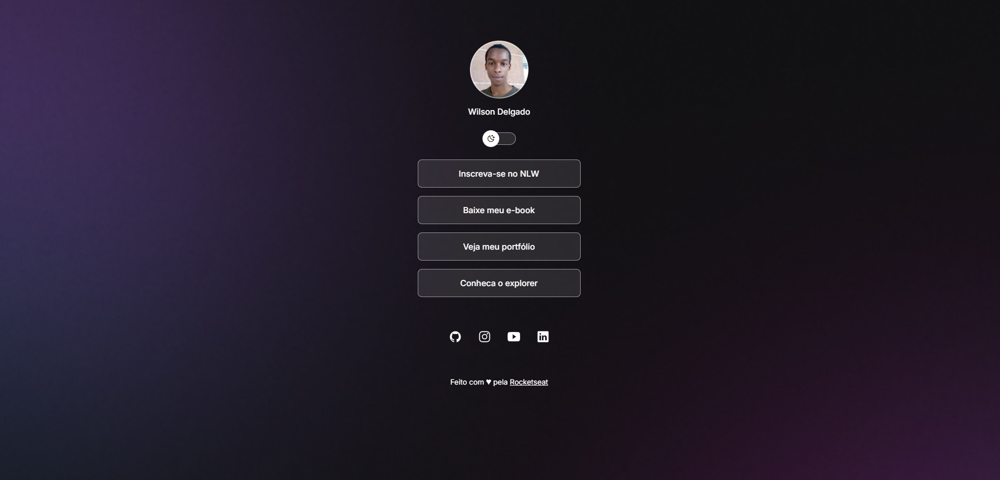

# 🚀 DevLinks

Este projeto é o DevLinks, desenvolvendo assistindo as aulas da RocketSeat no programa Discover. O  objetivo deste projeto é criar uma página web para apresentação de Links

Bom desafio!

## ✔️ Tecnologias utilizadas

As tecnologias utilizadas no desenvolvimento deste projeto são as seguintes:

- Html
- Css
- Javascript
- Git

## 😎 Página na web
- Pode consultar a aplicação em https://rocketseat-frontend-challenge.herokuapp.com/
